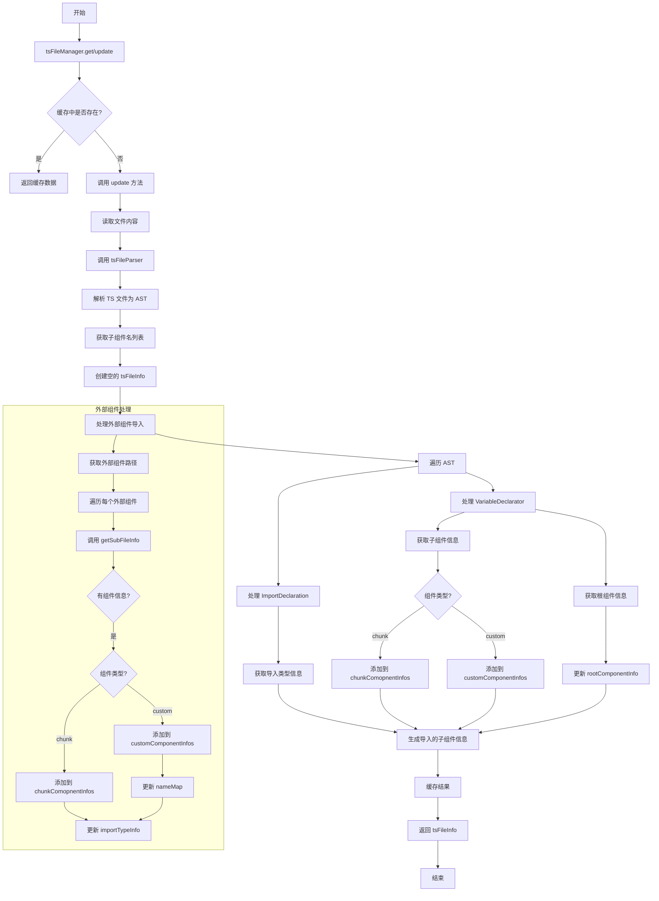

# TSFileManager 逻辑流程图

```mermaid
graph TD
    A[开始] --> B[tsFileManager.get/update]
    B --> C{缓存中是否存在?}
    C -->|是| D[返回缓存数据]
    C -->|否| E[调用 update 方法]
    E --> F[读取文件内容]
    F --> G[调用 tsFileParser]
    
    G --> H[解析 TS 文件为 AST]
    H --> I[获取子组件名列表]
    I --> J[创建空的 tsFileInfo]
    
    J --> K[处理外部组件导入]
    K --> L[遍历 AST]
    
    L --> M[处理 ImportDeclaration]
    L --> N[处理 VariableDeclarator]
    
    M --> O[获取导入类型信息]
    N --> P[获取子组件信息]
    N --> Q[获取根组件信息]
    
    P --> R{组件类型?}
    R -->|chunk| S[添加到 chunkComopnentInfos]
    R -->|custom| T[添加到 customComponentInfos]
    
    Q --> U[更新 rootComponentInfo]
    
    O --> V[生成导入的子组件信息]
    S --> V
    T --> V
    U --> V
    
    V --> W[缓存结果]
    W --> X[返回 tsFileInfo]
    
    X --> Y[结束]

    subgraph 外部组件处理
    K --> K1[获取外部组件路径]
    K1 --> K2[遍历每个外部组件]
    K2 --> K3[调用 getSubFileInfo]
    K3 --> K4{有组件信息?}
    K4 -->|是| K5{组件类型?}
    K5 -->|chunk| K6[添加到 chunkComopnentInfos]
    K5 -->|custom| K7[添加到 customComponentInfos]
    K7 --> K8[更新 nameMap]
    K6 --> K9[更新 importTypeInfo]
    K8 --> K9
    end
```
